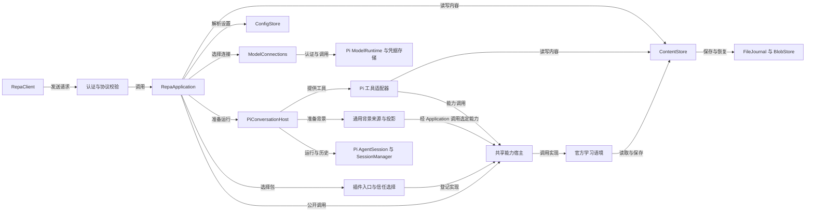

# 开发指南

本目录面向实现后端、Web、Desktop、公开客户端和能力适配器的开发者，说明当前代码的责任与调用方式。修改所属模块时同步维护相应说明。产品概念由根目录 [CONTEXT.md](../../CONTEXT.md) 持有，架构取舍由 [ADR](../adr/) 持有，尚待实现的接口建议集中在 [Issue #16](https://github.com/Utopia-V/repa/issues/16)。早期原型的代码结构和测试只说明当时的实现，不能代替已接受的产品设计。

## 参与开发

从当前 `dev` 分支开始，在 [Issue #5](https://github.com/Utopia-V/repa/issues/5) 确认任务范围；普通 PR 指向 `dev`。分支整合与阶段交付遵循[整合规范](integration.md)。在仓库根目录安装依赖：

```sh
npm ci
```

按工作范围选择入口：

| 范围 | 开发命令 |
| --- | --- |
| 后端与 TUI | `npm run dev:backend -- /path/to/learning-space` |
| 配置连接与默认模型 | `npm run dev:backend -- configure` |
| 独立后端联调 | `npm run dev:backend -- serve --connection-file /absolute/path/connection.json` |
| Web | `npm run dev:web` |
| Desktop | `npm run dev:desktop` |

Web 和 Desktop 会自动构建并启动各自的开发后端，不需要手工填写连接地址或令牌。提交评审前在根目录运行 `npm run check`、`npm test` 和 `npm run build`；具体代码入口见下一节。

能力包使用主包导出的 `repa/plugin`、`repa/protocol` 等接口，因此需要先构建主包。`npm run build:backend` 按这个顺序构建主包、材料、规划和复习包，纯 Skill 包无需编译。根目录检查、测试、后端启动，以及 Web／Desktop 的开发准备都使用此入口，干净目录也能建立完整后端。动态加载与构建顺序的取舍见[官方学习组合](official-learning.md#装配责任与构建顺序)。

## Web 界面

Web 与 Desktop 的主应用启动、连接提示和工作台侧栏已使用相同的语义 token 与组件行为；连接生命周期分别由各自的 `app.tsx` 持有。工作台默认进入 `/learning-space`，右侧居中显示学习材料选择组件；侧栏仅保留 Learning Space 和 Settings，Settings 内容暂时留空；侧栏接入见设计系统实现说明。

Web 开发约束见 [apps/web/AGENTS.md](../../apps/web/AGENTS.md)。

稳定视觉规则见 [设计系统规范](../design-system.md)，相关取舍见 [ADR 0006](../adr/0006-govern-frontend-visuals-through-a-semantic-design-system.md)。通用视觉由 `components/ui` 持有，业务组合位于 `components/domain`，页面负责布局。当前文件责任、主题适配、迁移范围、启动与验证入口统一见[设计系统实现说明](../design-system-implementation.md)。

## 工程边界

后端、CLI、公开客户端与协议位于 `packages/repa` workspace。完整 Web 前端和完整 Electron 前端分别位于 `apps/web` 与 `apps/desktop`，各自持有页面、路由、应用状态和宿主进程接入。仓库根目录持有唯一锁文件和统一命令，包内的相对路径用于实现与测试；renderer 只通过 `repa/client` 和 `repa/protocol` 使用后端能力，Node 宿主把现有 `repa serve` CLI 作为进程边界。

Web 入口创建 Browser Router，Electron renderer 创建 Memory Router，两端分别维护自己的路由配置和启动状态；连接建立是进入路由前的应用启动条件，不是业务页面。Web 的 Vite 开发宿主以进程专属连接文件启动现有 CLI，并通过同源端点提供临时连接；Electron main 以应用专属连接文件启动现有 CLI，并由隔离 preload 暴露 `getConnection`。renderer 调用 `RepaClient.connect`，连接恢复和状态投影继续由公开客户端持有。相似界面不通过通用 shared package 复用；出现多个真实调用方和稳定契约后，再按具体职责提取前端 package。

公开方法以当前提交的 [protocol.ts](../../packages/repa/src/protocol.ts) 及其导入的 schema 为准。协议仍为 v1，联调时固定双方使用的源码或构建提交。

本指南描述当前代码的接入与持久格式；需要理解设计原因时，查阅相应 ADR。内容编辑的需求、代价和可重新评估的策略见 [ADR 0003](../adr/0003-share-file-based-content-operations.md#编辑与保存)。Pi 当前锁定为 0.87.1；升级边界与回归入口见 [Agent 接入](agent-runtime.md#sdk-升级与验证)。

项目具体写法分别由[文档规范](../../.agents/skills/repa-docs-style/SKILL.md)、[测试规范](../../.agents/skills/repa-test-style/SKILL.md)和[代码规范](../../.agents/skills/repa-code-style/SKILL.md)持有；这些文件也供开发者直接阅读，适用入口由根目录 `AGENTS.md` 统一登记。

模块任务及接入关系见[实施入口 #5](https://github.com/Utopia-V/repa/issues/5)。开始一项工作时，先核对现有实现和可复用的 SDK 入口；完整联调依赖并不要求所有模块串行开发。当前 Pi 能力与实际接法见 [Agent 接入](agent-runtime.md#sdk-能力与接入范围)。

当前后端已经接通共享能力、插件包、命令执行和默认学习组合。Agent 工具与公开客户端共用处理函数，请求、配置和内容也使用已有模块。各插件负责自己的业务数据与算法，学习语境负责背景选择与展开。

官方界面、生成展示和真实模型学习体验还需要联合验收。具体缺口记录在各模块的“未完成项与待验证项”，整体范围见[官方学习组合](official-learning.md#未完成项与待验证项)。

## 从哪里开始

| 工作 | 入口与责任 |
| --- | --- |
| 修改 Web 页面、路由或开发宿主 | [app.tsx](../../apps/web/src/app.tsx)、[routes.tsx](../../apps/web/src/routes.tsx) 持有界面与路由；[repa-development-backend.ts](../../apps/web/repa-development-backend.ts) 与 [vite.config.ts](../../apps/web/vite.config.ts) 持有开发期后端启动和连接交付 |
| 修改 Desktop 页面或原生边界 | [app.tsx](../../apps/desktop/src/renderer/src/app.tsx)、[routes.tsx](../../apps/desktop/src/renderer/src/routes.tsx) 持有界面与路由；[main/index.ts](../../apps/desktop/src/main/index.ts)、[repa-process.ts](../../apps/desktop/src/main/repa-process.ts) 与 [preload/index.ts](../../apps/desktop/src/preload/index.ts) 持有进程和窄 IPC 边界 |
| 接入前端、读取状态或保存内容 | [client.ts](../../packages/repa/src/client.ts)：标准 WebSocket、Fetch、协议校验和状态副本，不依赖 Pi 或后端模块 |
| 增加公开调用 | [protocol.ts](../../packages/repa/src/protocol.ts)、[server.ts](../../packages/repa/src/server.ts)：参数和结果校验、认证、传输；内容契约在 [content/protocol.ts](../../packages/repa/src/content/protocol.ts) |
| 修改输入、排队、失败接续和后台请求 | [输入、请求与运行](requests.md)：受理记录、Pi 投递、资源保留、分页及订阅 |
| 处理应用内的操作顺序与退出 | [application.ts](../../packages/repa/src/application.ts)：空间实例、请求受理、配置固定、订阅与进行中工作；释放空间前等待 Agent 和内容操作收尾 |
| 修改正文、身份或内容组成 | [内容与保存](content.md)：共同的版本检查、文件操作、资源和恢复入口 |
| 执行命令、处理授权与子进程 | [命令执行与授权](execution.md)：Pi Bash SDK、独立 helper、实际请求归属、输出与退出 |
| 搜索内容、历史或提取本地材料 | [搜索与材料](search-materials.md)：rg 预筛、实际字节快照、冻结历史、结果分页与独立材料包 |
| 接入复习、实际反馈和参数优化 | [复习插件](review.md)：FSRS、SQLite、追加更正、候选参数及公开操作与通知 |
| 创建或调整学习计划 | [规划能力](planning.md)：可替换方法、实际时钟、日期与时间约束检查，正文沿用内容工具 |
| 整理长期内容与当前语境 | [整理能力](organization.md)：方法 Skill、同次正文与结构保存、模型可见的身份及操作查询 |
| 调整默认学习组合与教学方法 | [官方学习组合](official-learning.md)：分发依赖、精确来源、整组／单项启停，以及当前联合验收缺口 |
| 修改学习语境及其持久格式 | [官方学习语境](learning.md)：选择、组成、展开、旧格式与背景 codec；保存继续复用内容模块 |
| 接入共享后端能力与窄服务 | [能力宿主](capabilities.md)：契约、作用域、Agent 工具与公共调用、按需空间生命周期 |
| 发现、启用或管理插件包 | [插件装配](plugins.md)：Pi 包来源、资源信任、多入口、独立快照与实际进程重启 |
| 管理媒体、版本保留、会话删除和回收 | [资源持有与清理](resources.md)：实际消费者、展示宿主、准备期、重连与历史清理 |
| 备份、恢复或复制整个空间 | [空间快照](spaces.md)：目录发布、格式 owner、插件数据参与与中断结果 |
| 修改模型实际得到的输入、工具或提示来源 | [Agent 接入](agent-runtime.md)：Pi 运行边界、可控来源、实际读取基准及压缩后的工作视图 |
| 管理模型连接、认证与持久配置 | [模型连接与运行配置](models-configuration.md)：具名身份、Pi 认证、逐项继承、运行绑定与静态预览 |
| 修改会话历史或运行记录 | [pi-sessions.ts](../../packages/repa/src/pi-sessions.ts) 适配 Pi 会话树；[runtime-store.ts](../../packages/repa/src/runtime-store.ts) 与 [run-journal.ts](../../packages/repa/src/run-journal.ts) 持有空间锁和请求事实 |

`packages/repa/src/storage/` 只提供原子替换、串行队列、受管理目录和不可变字节存储。内容身份、恢复判定、配置继承和 Agent 行为留在各自模块，不能从通用文件辅助函数推导产品语义。

## 当前接通的调用路径


```mermaid
flowchart LR
    Client[RepaClient] -->|发送请求| Server[认证与协议校验]
    Server -->|调用| App[RepaApplication]
    App -->|读写内容| Content[ContentStore]
    App -->|解析设置| Config[ConfigStore]
    App -->|选择连接| Models[ModelConnections]
    Models -->|认证与调用| Runtime[Pi ModelRuntime 与凭据存储]
    App -->|准备运行| Host[PiConversationHost]
    Host -->|提供工具| Tools[Pi 工具适配器]
    Tools -->|读写内容| Content
    App -->|选择包| Plugins[插件入口与信任选择]
    Plugins -->|登记实现| Capability[共享能力宿主]
    App -->|公开调用| Capability
    Tools -->|能力调用| Capability
    Capability -->|调用实现| Learning[官方学习语境]
    Learning -->|读取与保存| Content
    Host -->|准备背景| Background[通用背景来源与投影]
    Background -->|经 Application 调用选定能力| Capability
    Content -->|保存与恢复| Journal[FileJournal 与 BlobStore]
    Host -->|运行与历史| Pi[Pi AgentSession 与 SessionManager]
```

内容 API 和模型工具共用保存入口，能力 API 和工具共用处理函数。客户端能力调用通过请求模块保存记录，Agent 工具使用父运行的身份与取消信号。具体调用方式见[能力宿主](capabilities.md)，记录与恢复见[请求说明](requests.md)。

Host 使用学习能力准备好的背景，处理快照复用和压缩后补回。学习语境的选择与展开留在学习模块，文件保存和引用映射使用内容模块。关闭官方学习组合后，普通 Agent 与内容操作可用，原文档、绑定和历史快照保留。

图形组件宿主、共享草稿与前端入口的加载尚待接通。命令执行已接入，平台适用范围和安装验证见[执行说明](execution.md#构建与独立启动)。

## 运行与验证

根目录统一验证命令：

```sh
npm run check
npm test
npm run build
```

后端测试使用 Node 自带测试器，所有 `packages/repa/test/*.test.ts` 都进入 `npm test`。Pi 集成使用锁定 SDK 的真实会话、工具和压缩流程，模型由本地 faux provider 提供确定性响应，无需模型凭据。

| 需要保护的行为 | 主要验证入口 |
| --- | --- |
| 文件修改、版本冲突、身份移动、重复操作和中断恢复 | [content.test.ts](../../packages/repa/test/content.test.ts)、[content-patch.test.ts](../../packages/repa/test/content-patch.test.ts) |
| 两个客户端共享保存结果、完整资源、空间外材料和退出期间保存 | [content-api.test.ts](../../packages/repa/test/content-api.test.ts) |
| 内容复制、循环组成、多个版本持有和清理后防止重放 | [content-lifecycle.test.ts](../../packages/repa/test/content-lifecycle.test.ts) |
| 空间复制、恢复、外部变化和 SQLite 快照参与 | [space-lifecycle.test.ts](../../packages/repa/test/space-lifecycle.test.ts) |
| 模型工具经共同内容入口读写、部分读取、取消与外部修改 | [agent-tools.test.ts](../../packages/repa/test/agent-tools.test.ts) |
| 已观察文件的变化提示、差异基准与按需读取 | [file-changes.test.ts](../../packages/repa/test/file-changes.test.ts) |
| 实际模型输入、来源关闭、空提示、重复注入和压缩 | [agent-context.test.ts](../../packages/repa/test/agent-context.test.ts)、[pi-context-integration.test.ts](../../packages/repa/test/pi-context-integration.test.ts) |
| 配置与外部文件授权的持久化、并发写入 | [configuration.test.ts](../../packages/repa/test/configuration.test.ts)、[content-access.test.ts](../../packages/repa/test/content-access.test.ts) |
| 具名连接、认证身份、运行选择、独立模型调用与提示预览 | [model-connections.test.ts](../../packages/repa/test/model-connections.test.ts)、[model-api.test.ts](../../packages/repa/test/model-api.test.ts)、[cli-models.test.ts](../../packages/repa/test/cli-models.test.ts) |
| 共享能力、SQLite 按需资源、公共调用与父 Agent 工具 | [capabilities.test.ts](../../packages/repa/test/capabilities.test.ts)、[capability-api.test.ts](../../packages/repa/test/capability-api.test.ts)、[capability-resources.test.ts](../../packages/repa/test/capability-resources.test.ts) |
| 命令授权、真实隔离、取消和完整输出生命周期 | [execution-process.test.ts](../../packages/repa/test/execution-process.test.ts)、[execution-api.test.ts](../../packages/repa/test/execution-api.test.ts) |
| 搜索定位、冻结分页与本地材料格式和取消 | [搜索与材料验证](search-materials.md#验证入口与固定版本)：内容/历史查询、公共工具和编译包入口 |
| 真实 FSRS、复习事务、工具与参数优化 | [复习验证](review.md#验证入口)：算法、SQLite、公共操作、插件快照和独立优化进程 |
| 学习规划方法与时间约束 | [规划验证](planning.md#验证)：Temporal、真实 Pi 读 Skill／检查／保存和外部编辑后接续 |
| 官方后端默认装配与持续学习 | [组合验证](official-learning.md#验证入口)：干净配置、真实工具、实际反馈、关闭后复制重启与精确来源替换 |
| 内容整理与语境接续 | [整理验证](organization.md#验证入口)：共同补丁、真实模型输入、人工改动保留与失败操作查询 |
| 包多入口、资源信任、发现无副作用与包管理 | [plugin-packages.test.ts](../../packages/repa/test/plugin-packages.test.ts)、[plugin-resources.test.ts](../../packages/repa/test/plugin-resources.test.ts)、[plugin-api.test.ts](../../packages/repa/test/plugin-api.test.ts) |
| 后端、客户端、TUI、恢复与真实子进程生命周期 | [application.test.ts](../../packages/repa/test/application.test.ts)、[run-journal.test.ts](../../packages/repa/test/run-journal.test.ts) |
| Web HTTP 连接交付、真实后端启动及退出清理 | [Web 宿主集成测试](../../apps/web/test/backend.integration.test.ts) |
| Desktop 后端进程复用、退出与再次启动 | [Desktop 宿主集成测试](../../apps/desktop/test/backend.integration.test.ts) |

当前整合版本已在 Linux 上通过类型检查、测试与构建，包含 Web 与 Desktop 宿主连接真实后端的测试。

两项前端宿主集成测试沿用 Vitest，在 Node 环境中启动真实 `repa serve` 子进程并通过 `RepaClient` 打开、查询临时学习空间；Web 额外经过真实 Vite HTTP 连接端点。配置和内容使用独立临时目录，测试结束清理后端与文件，无需模型凭据或新增测试依赖。运行根目录 `npm test` 会先构建后端并包含这些测试；仅运行前端或能力 workspace 测试前需先执行 `npm run build:backend`。
